## Docker相关知识

**docker：是一个引擎，类似于一个可以驱动操作系统的平台**

**image：操作系统镜像，一般是由很小的一个操作系统作为底层，然后安装特定的软件，打包成image**，**可以理解为模板模具

**container：容器，image实例化的产物，可以真正运行的系统，可以理解为由模板产生的实体**

下图进行一个类比

|  docker   |   java   |        解释        |
| :-------: | :------: | :----------------: |
|  docker   |   jvm    | 一个平台，一种引擎 |
|   image   |  class   |     抽象的物体     |
| container | instance |  由抽象生成的实例  |

镜像分为很多不同的版本（tag），使用imageName:tag区分

容器的状态分为

+ **创建 create**
+ **运行 up 27 hours**
+ **暂停 up 27 hours（Paused）** 
+ **退出 Exited**
+ 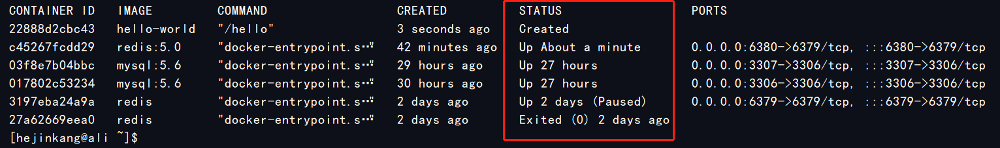

## Docker相关命令

### 启动docker

```shell
systemctl start docker
```

### 拉取镜像

```shell
docker image pull <imageName>:<tag>
```

从指定image仓库拉取镜像，默认为Docker Hub，其中第一个参数是镜像名称，第二个参数是镜像标签，如果不加默认为latest

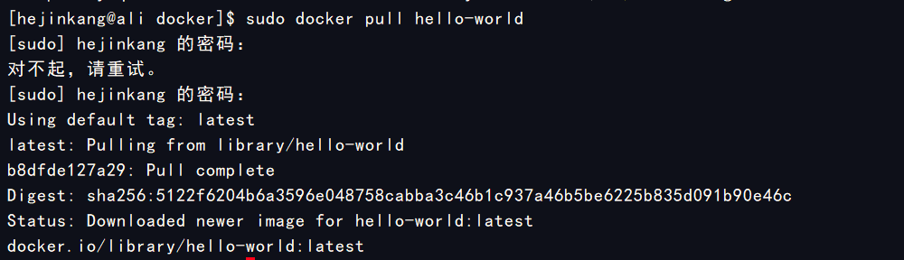

### 查看镜像

```shell
docker images
docker image ls
```

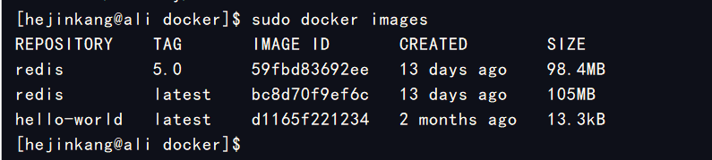

### 删除镜像

```shell
docker image rm <imageName>
```

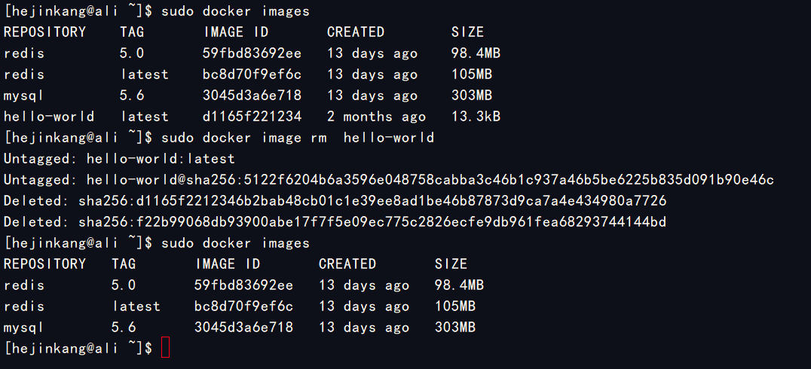

### 创建容器

创建容器之后，容器并没有启动

```
docker create <imageName>
```

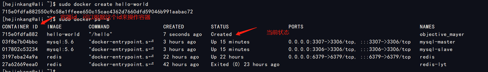

### 启动容器

```shell
# -a 表示输出到前台
sudo docker start -a 715
```

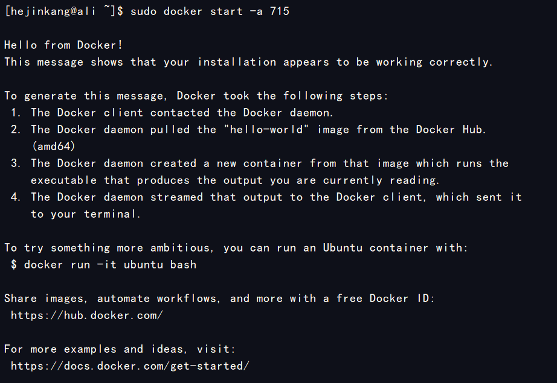

也可以直接使用run命令来运行，run = create+start

```shell
docker run hello-world
```

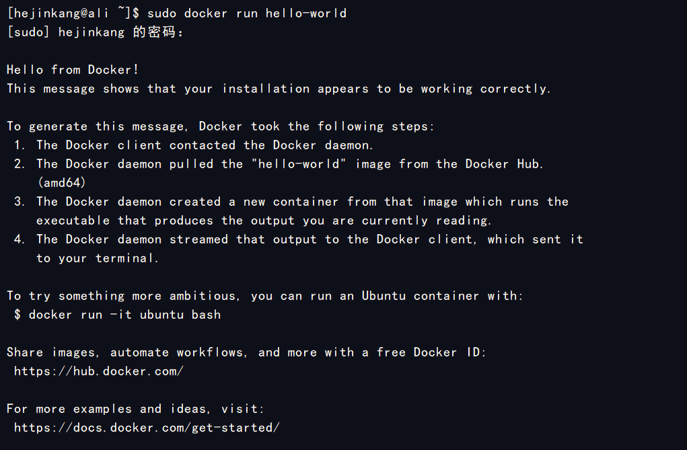

### 查看容器列表

```shell
# 查看运行中的容器
docker ps 
# 查看所有容器
docker ps -a
```

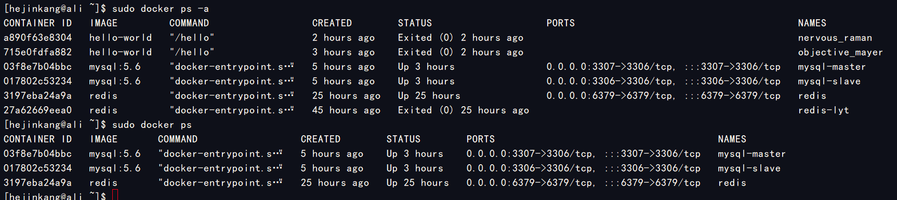

### 运行参数

实际上，启动一个容器往往需要设置很多参数，比如容器如果想和外部通信，则需要端口映射；如果想和外部的磁盘交互，则需要文件路径映射；启动时需要一些内部的设置，则需要设置环境变量，输入docker run --help可以看到所有参数设置

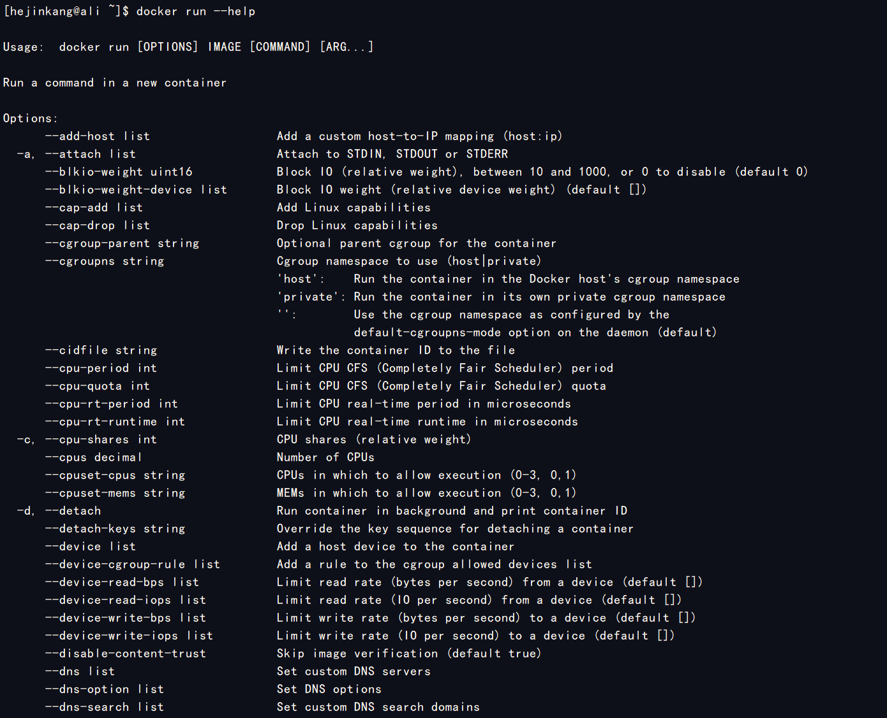

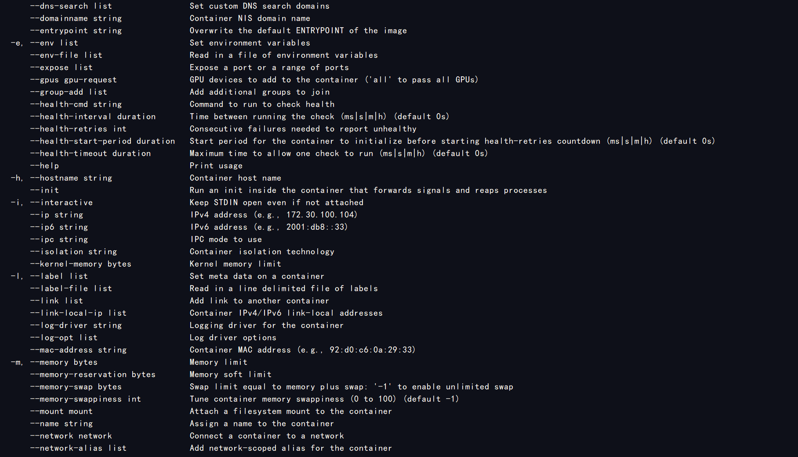

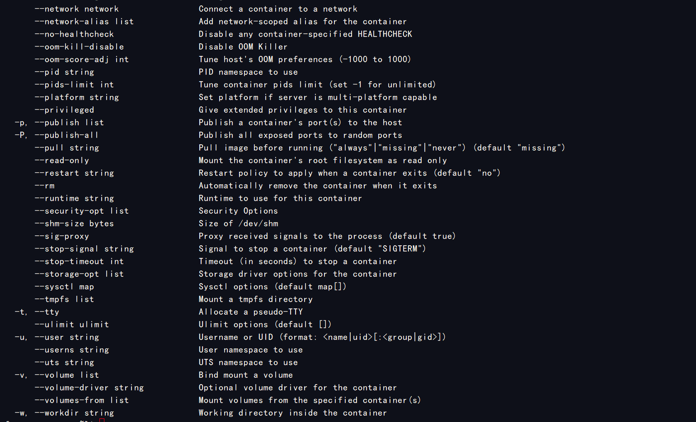

以下对几个常用的参数作一个大概说明

| 参数名 |        说明        |                             用法                             |
| :----: | :----------------: | :----------------------------------------------------------: |
|   -d   |      后台运行      |                                                              |
|   -p   |      端口映射      |  -p 3306:3306 docker主机上的3306端口映射容器里面的3306端口   |
|   -v   | 外部文件挂载(映射) | -v /etc/data:/data 将docker主机的 /etc/data 目录和容器内部的/data映射起来 |
|   -e   |      环境变量      |  这个可以在官方镜像里面的使用说明找到运行容器的一些环境变量  |

### 进入容器内部


### 停止容器

```shell
docker stop hello-world
```

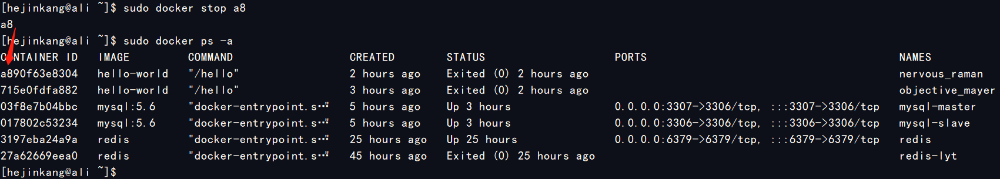

### 杀掉容器进程

==推荐使用stop==

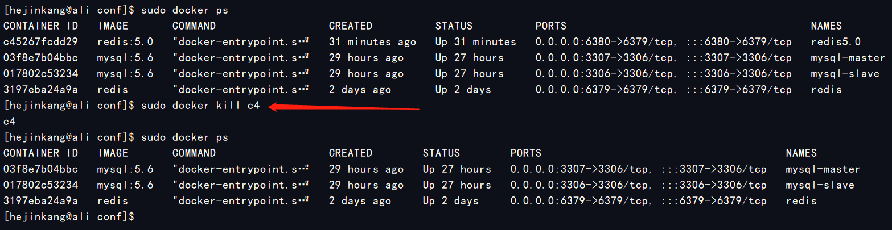

### 删除容器

删除容器之前请确保容器已经停止

```shell
docker rm hello-world
```

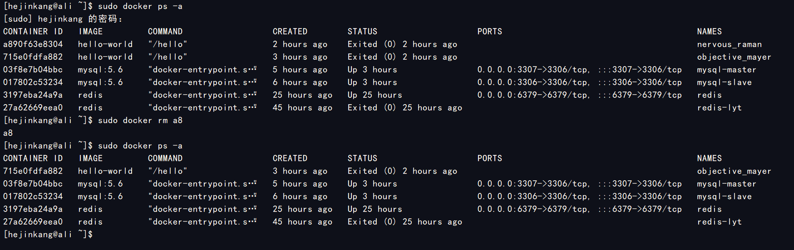

## Docker实战1——安装运行redis

### 1.获取镜像

可以去dockerhub 官方仓库https://registry.hub.docker.com/搜索需要的镜像，然后选择自己需要的版本


本例使用5.0版本进行演示

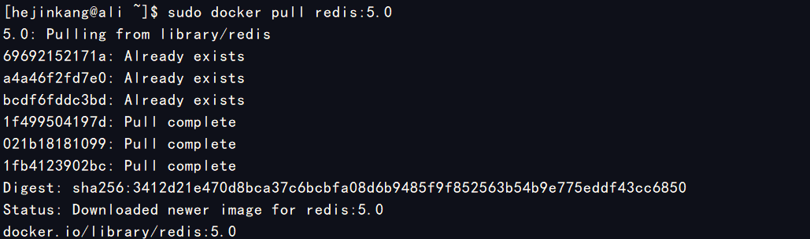

### 2.目录映射

下载好镜像之后，可以在官方实例看到一些基础的命令和相关配置

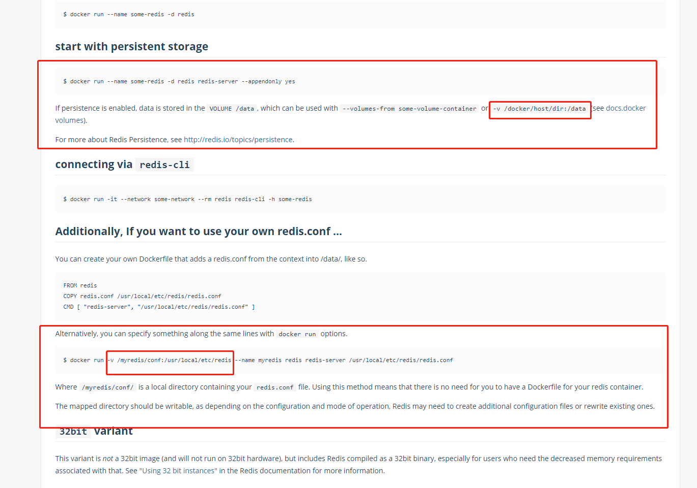

redis启动时需要配置文件你，如果我们想指定某些配置，需要做一个配置文件的映射；如果想持久化数据也可以做一个持久化目录的映射，可以看到容器里配置文件的目录是**/usr/local/etc/redis**，持久目录是**/data**，我们在docker主机上建立对应的目录映射起来

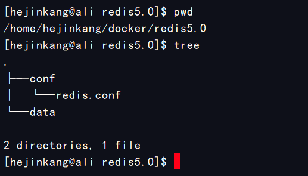

这是我的主机目录配置

### 3.配置文件配置

在创建好配置文件的目录之后，在配置文件目录里面创建一个名为**redis.conf**的文件，加入自己需要的配置

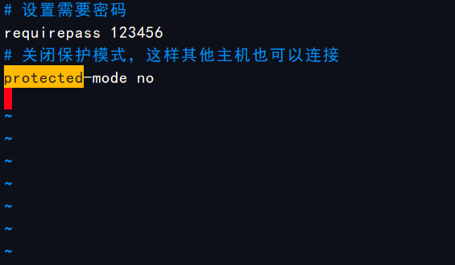

更多详细配置请参考redis官网

### 4.启动

|                           启动参数                           |                说明                |
| :----------------------------------------------------------: | :--------------------------------: |
| **-v /home/hejinkang/docker/redis5.0/conf:/usr/local/etc/redis** |          **配置文件映射**          |
|      **-v /home/hejinkang/docker/redis5.0/data:/data**       |         **持久化目录映射**         |
|                       **-p 6780:6739**                       | **端口映射，主机6380映射容器6379** |
|                            **-d**                            |            **后台运行**            |
|                     **--name redis5.0**                      |      **设置容器名为redis5.0**      |
|                     **--appendonly yes**                     |       **开启aof持久化模式**        |

最后命令如下

```shell
docker run -v /home/hejinkang/docker/redis5.0/conf:/usr/local/etc/redis -v /home/hejinkang/docker/redis5.0/data:/data -p 6380:6379 -d --name redis5.0 redis:5.0 redis-server /usr/local/etc/redis/redis.conf --appendonly yes
```

运行会返回容器id，查看容器进程列表能找到该进程

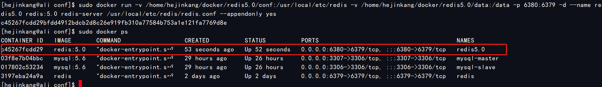

### 5.客户端连接测试

客户端测试输入服务器ip，端口和设置好的密码，可以看到redis连接成功显示信息

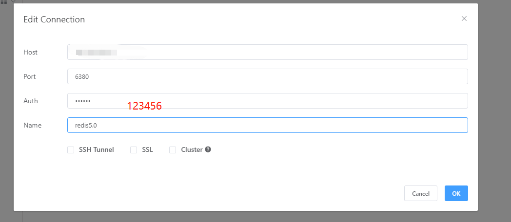

连接信息

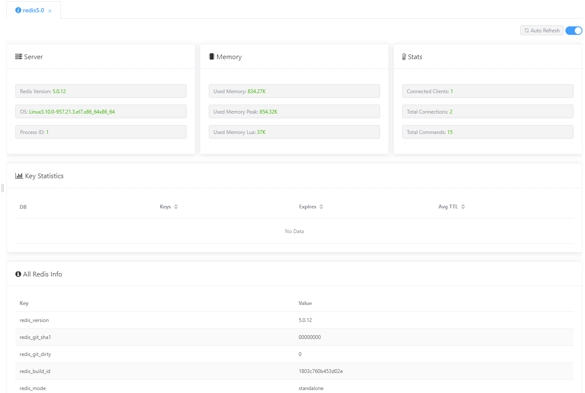

## Docker实战2——安装运行mysql

安装mysql和redis大同小异，重复部分不再赘述，特殊之处在于启动的时候可以通过环境变量设置root密码，其他环境变量也可以在官网上找到

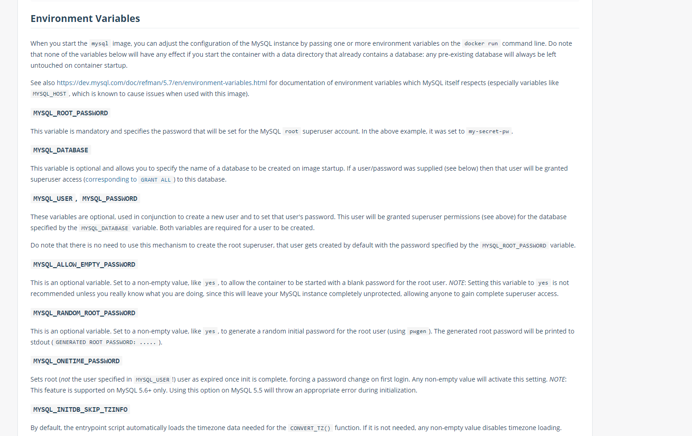

下面是使用环境变量的启动命令，仅供参考，可以查询官网获取更多信息

```shell
sudo docker run -d --name mysql -p 3306:3306 -e MYSQL_ROOT_PASSWORD=123456 mysql:5.0
```

