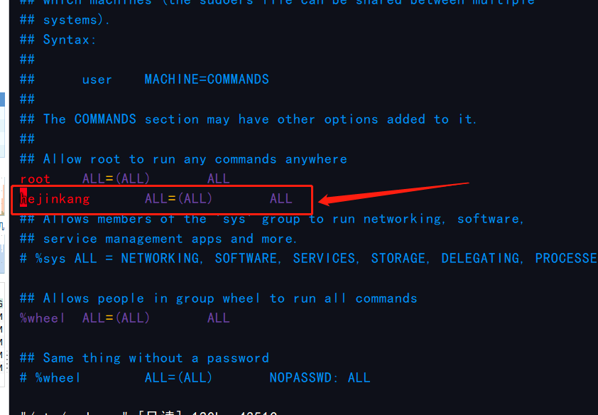

## 系统相关

1. 查看主机名

```shell
[hejinkang@iZ0r6y1vzmrvy0Z ~]$ hostname
iZ0r6y1vzmrvy0Z
```

2. 修改主机名

```shell
[hejinkang@iZ0r6y1vzmrvy0Z ~]$ hostnamectl set-hostname ali
## 需重启生效
```

3. 查看主机状态

```shell
[hejinkang@ali ~]$ top
```


## 文件相关

1.  新建目录

```shell
[hejinkang@ali ~]$ mkdir docker
[hejinkang@ali ~]$ ls
docker
```

2. 进入目录

```shell
[hejinkang@ali ~]$ cd docker/
[hejinkang@ali docker]$ 
```

3. 新建文件

```shell
[hejinkang@ali docker]$ touch mysql
[hejinkang@ali docker]$ ls
mysql
[hejinkang@ali docker]$ 
```

4.  移动（重命名）文件

```shell
[hejinkang@ali docker]$ mv mysql yoursql
[hejinkang@ali docker]$ ls
yoursql
[hejinkang@ali docker]$ 
```

5.  删除文件（目录）

```shell
##文件
[hejinkang@ali docker]$ rm yoursql 
[hejinkang@ali docker]$ ls
[hejinkang@ali docker]$ 
##目录
[hejinkang@ali ~]$ ls
docker
[hejinkang@ali ~]$ rm -rf docker/
[hejinkang@ali ~]$ ls
[hejinkang@ali ~]$ 

```

6. 获取文件最后几行

```shell
[hejinkang@ali ~]$ tail -n 100 log.out
```


## 用户相关

1. 新增用户

```shell
[root@ali ~]# useradd hejinkang
```

2. 修改用户密码

```shell
[root@ali ~]# passwd hejinkang
更改用户 hejinkang 的密码 。
新的 密码：
重新输入新的 密码：
passwd：所有的身份验证令牌已经成功更新。
```

3. 删除用户

```shell
##删除用户不删除用户相关文件夹
[root@ali ~]# userdel test
##删除用户同时删除用户相关文件夹 
[root@ali ~]# userdel -r test
##强制删除用户，用户登录的情况下也能删除
[root@ali ~]# userdel -f test
```

4. 给普通用户root权限

```shell
##修改该文件，加上如图所示一行保存退出即可
##表示在任何主机上可以运行任何命令在任何地方
[root@ali ~]# vim /etc/sudoers
```



5. 切换用户

```shell
[root@ali ~]# su hejinkang
[hejinkang@ali root]$ 
```

