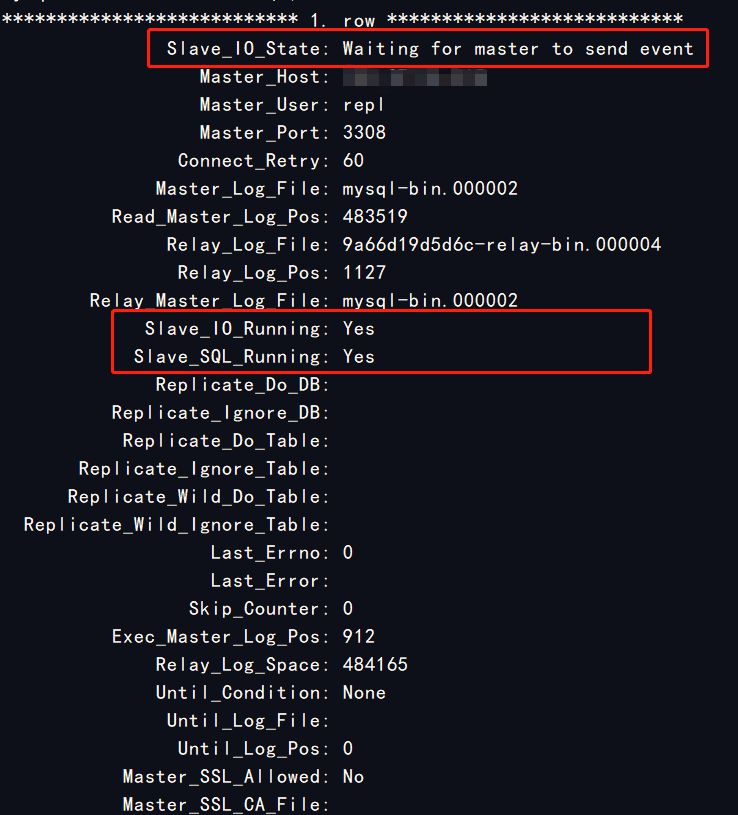
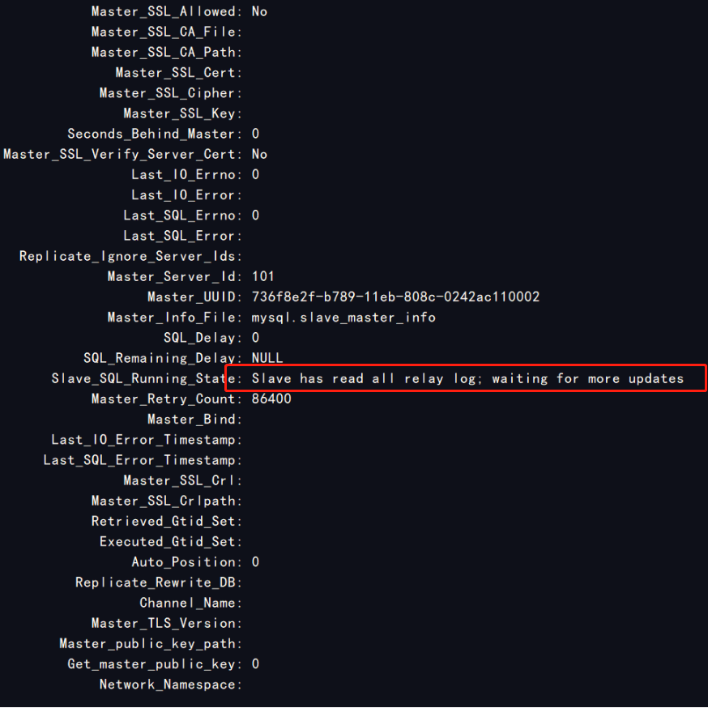
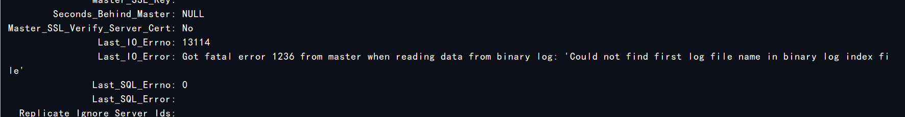

## 1.环境

| 系统软件 | 版本                                 |
| -------- | ------------------------------------ |
| mysql    | 8.0.12                               |
| os       | CentOS Linux release 7.6.1810 (Core) |
| docker   | 19.03.12, build 48a66213fe           |


## 2.相关映射文件的准备

在目录下建立两个文件夹，用来映射主mysql和从mysql的相关文件


其中data文件用来存放产生的数据，.cnf文件作为启动的配置文件

其中配置文件核心内容如下,主从的改一下server-id即可，不能重复

```shell
###主从数据库配置核心部分
[mysqld]
# 设置同步的binary log二进制日志文件名前缀，默认为binlog
log-bin=mysql-bin
# 服务器唯一id，默认为1  主数据库和从数据库的server-id不能重复
server-id=1    
```


##  3.启动容器

创建主节点

```shell
sudo docker create --name mysql-master -v /home/hejinkang/docker/mysql/master/data:/var/lib/mysql -v /home/hejinkang/docker/mysql/master:/etc/mysql/conf.d -e MYSQL_ROOT_PASSWORD=123456 -p 3308:3306 mysql:latest
```

创建从节点

```shell
sudo docker create --name mysql-slave -v /home/hejinkang/docker/mysql/slave/data:/var/lib/mysql -v /home/hejinkang/docker/mysql/slave:/etc/mysql/conf.d -e MYSQL_ROOT_PASSWORD=123456 -p 3307:3306 mysql:latest
```

==其中--name指定了容器的名称，可以通过名称直接启动，-v指定了相关文件的映射，-e指定了容器内环境变了，-p指定了端口映射==

### 1）主数据库操作

```mysql
 ## 创建一个用户，从节点用这个用户来进行同步操作，也可以使用root（不推荐）
 create user 'repl'@'%' identified by '123456';
 ## 给创建的用户授权同步复制的权限
 grant replication slave on *.* to 'repl'@'%';
 ## 刷新权限
 flush privileges;
```

==注意：如果操作时提示用户没有权限，则需要先授权给root用户==

```mysql
grant all on *.* to 'root'@'localhost';
```

然后查询主节点日志文件的相关信息

```mysql
show master status;
```


需要记住File和Position的值，决定了从节点从哪个文件的哪个位置开始同步

### 2）从数据库操作

```mysql
change master to MASTER_HOST='192.168.0.1',MASTER_PORT=3308,MASTER_USER='root',MASTER_PASSWORD='123456',
MASTER_LOG_FILE='mysql_bin.000003',MASTER_LOG_POS=120;
```

==需要替换自己的ip和端口==

|      参数       |                   说明                    |
| :-------------: | :---------------------------------------: |
|   MASTER_HOST   |                 主机地址                  |
|   MASTER_PORT   |            端口号，默认为3306             |
|   MASTER_USER   |                登陆用户名                 |
| MASTER_PASSWORD |                   密码                    |
| MASTER_LOG_FILE |      日志文件名(master status的File)      |
| MASTER_LOG_POS  | 日志记录起始位置(master status的Position) |

设置好之后,启动同步命令，查看启动状态

```mysql
## 启动同步
start slave;
## 查看状态
show slave status\G;
```

正常情况下会出现如下画面，表示设置成功，正常进行同步





==注意：如果启动失败，失败原因也可以用此命令进行查看==


这个错误是密码的加密插件问题，需要修改加密插件，登陆主库

```mysql
alter user 'repl'@'%' identified with mysql_native_password by '123456';
flush privileges;
```

然后在从库重新启动同步即可



如果出现这个错误，reset从节点即可

```mysql
stop slave;
reset slave;
start slave;
```

测试在主库新建数据库，新建表插入数据，从库也能查到数据，证明主从同步配置成功